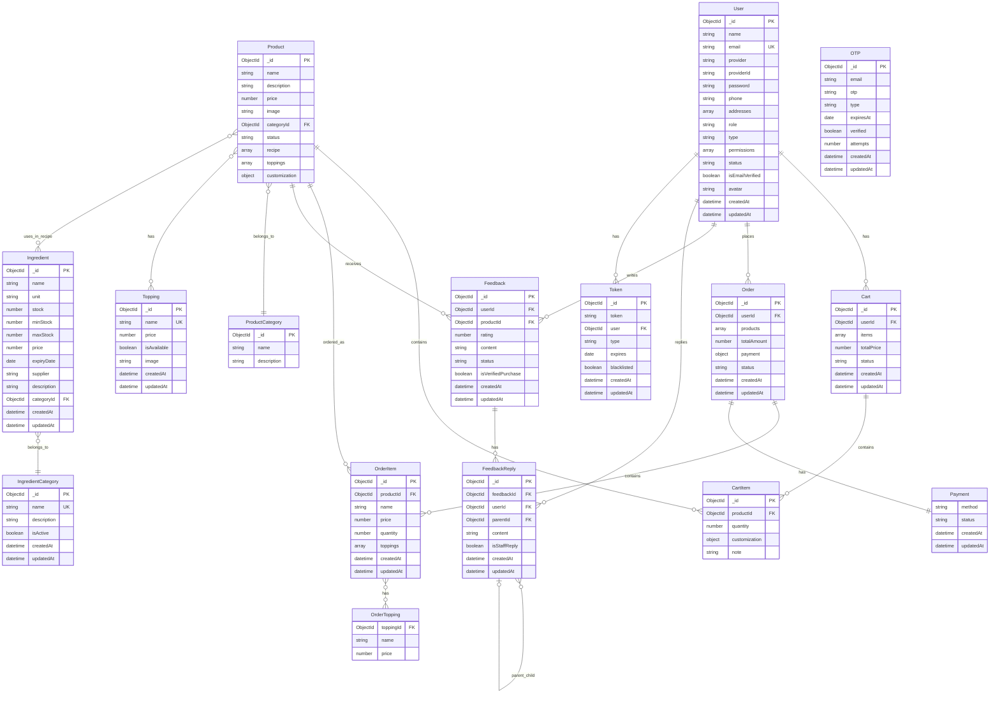
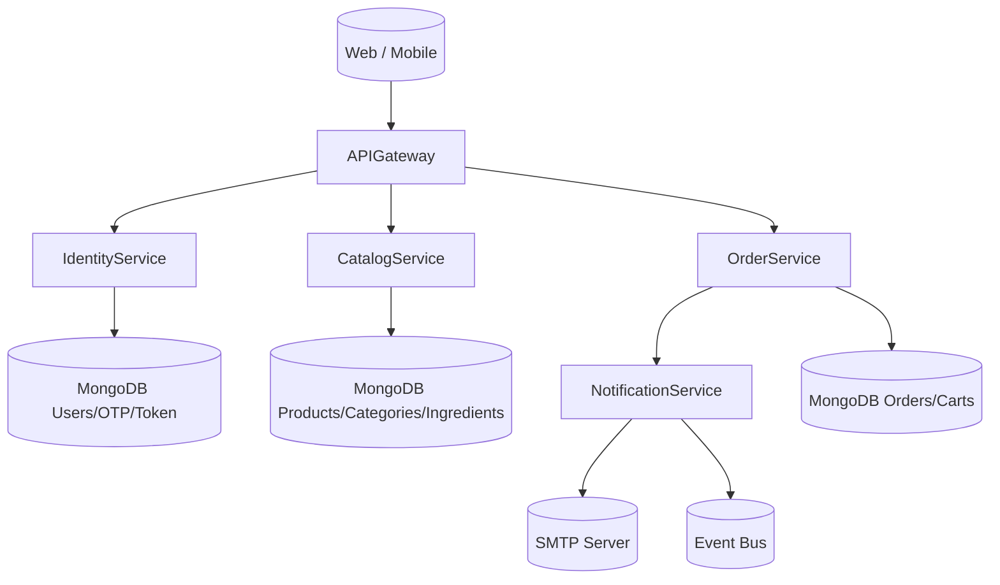
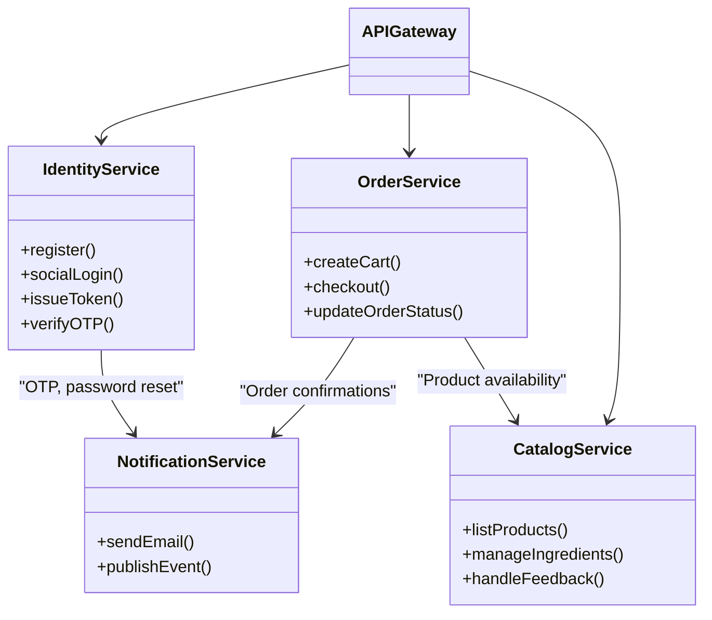
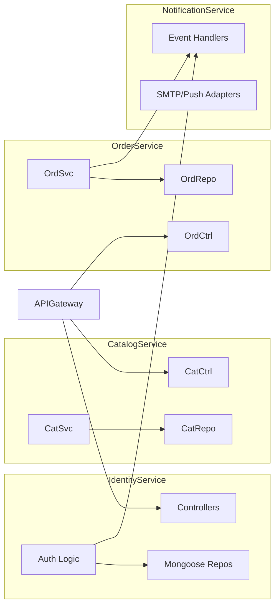
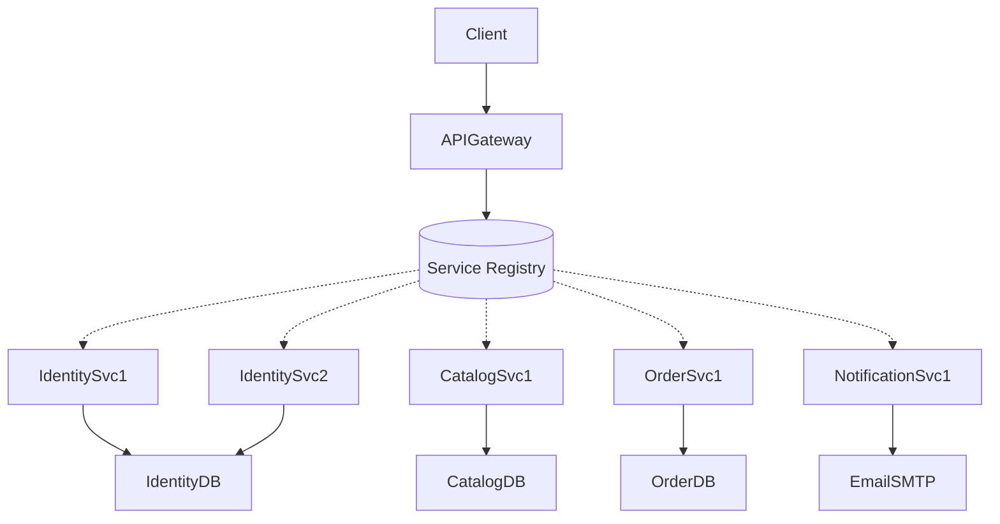
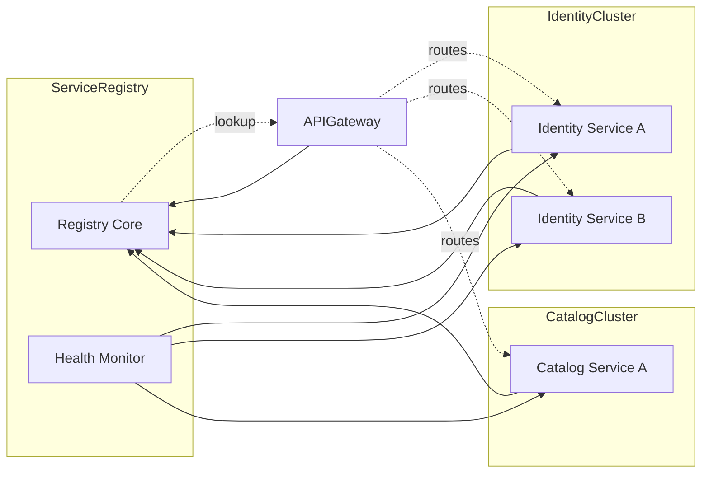

# Entity Relationship Diagram (ERD) - TheTrois Backend

## Mermaid ERD Diagram

## Relationships Summary

### One-to-Many Relationships

- **User → Cart**: Một user có nhiều giỏ hàng (active/checked_out)
- **User → Order**: Một user có nhiều đơn hàng
- **User → Feedback**: Một user viết nhiều đánh giá
- **User → FeedbackReply**: Một user viết nhiều phản hồi
- **User → Token**: Một user có nhiều token (refresh, reset password, verify email)
- **Product → CartItem**: Một sản phẩm xuất hiện trong nhiều giỏ hàng
- **Product → OrderItem**: Một sản phẩm được đặt trong nhiều đơn hàng
- **Product → Feedback**: Một sản phẩm nhận nhiều đánh giá
- **Cart → CartItem**: Một giỏ hàng chứa nhiều items
- **Order → OrderItem**: Một đơn hàng chứa nhiều items
- **Feedback → FeedbackReply**: Một feedback có nhiều replies

### Many-to-One Relationships

- **Product → ProductCategory**: Nhiều sản phẩm thuộc một danh mục
- **Ingredient → IngredientCategory**: Nhiều nguyên liệu thuộc một danh mục

### Many-to-Many Relationships

- **Product ↔ Topping**: Một sản phẩm có nhiều topping, một topping thuộc nhiều sản phẩm
- **Product ↔ Ingredient** (via recipe): Một sản phẩm dùng nhiều nguyên liệu, một nguyên liệu dùng cho nhiều sản phẩm
- **OrderItem ↔ Topping** (snapshot): OrderItem lưu snapshot của toppings tại thời điểm đặt hàng

### Self-Referencing Relationships

- **FeedbackReply → FeedbackReply** (parentId): Hỗ trợ threading (reply của reply)

### One-to-One Relationships

- **Order → Payment**: Mỗi đơn hàng có một thông tin thanh toán (embedded)

## Collections Overview

| Collection               | Purpose               | Key Features                                     |
| ------------------------ | --------------------- | ------------------------------------------------ |
| **users**                | User accounts         | Social login (Google/Facebook), roles, addresses |
| **products**             | Product catalog       | Recipe, toppings, customization, categories      |
| **productcategories**    | Product categories    | Simple categorization                            |
| **ingredients**          | Ingredient inventory  | Stock management, expiry tracking                |
| **ingredientcategories** | Ingredient categories | Organize ingredients                             |
| **toppings**             | Available toppings    | Price, availability                              |
| **carts**                | Shopping carts        | Auto-calculate total, items with customization   |
| **orders**               | Order history         | Payment info, status tracking, product snapshots |
| **feedbacks**            | Product reviews       | Rating, verified purchase, approval workflow     |
| **feedbackreplies**      | Feedback responses    | Threading support, staff replies                 |
| **tokens**               | JWT tokens            | Refresh, password reset, email verification      |
| **otps**                 | OTP codes             | Register/forgot password, auto-expire            |

## Key Business Rules

1. **Cart Total Calculation**: Automatically calculated before save using pre-save hooks
2. **Order Snapshots**: OrderItems store product/topping names and prices at order time
3. **Password Hashing**: User passwords are automatically hashed on save
4. **Token Expiry**: Tokens and OTPs have expiration dates
5. **Feedback Threading**: FeedbackReplies support nested replies via parentId
6. **Stock Management**: Ingredients track min/max stock levels
7. **Social Login**: Users can register via Google/Facebook (provider field)
8. **Email Verification**: OTP-based verification for registration and password reset

## Indexes

- **users**: email (unique)
- **ingredients**: categoryId
- **toppings**: name (unique, case-insensitive)
- **feedbacks**: (productId, rating) compound index
- **tokens**: token
- **otps**: expiresAt (TTL index for auto-deletion)

---

Generated: October 27, 2025

## V. Implementation

### V.1 Map Architecture to the Structure of the Project

**Overview of the Chosen Architecture**

- Architectural style: Layered modular monolith (Express + Mongoose) with clear separation between presentation, business logic, data access, and cross-cutting concerns.
- Rationale: balances maintainability (layers isolate change), scalability (horizontal scaling of a single deployable), and reusability (services decouple domain logic from transport). The lightweight stack suits the team size and current requirements, while leaving room for future extraction into services.

**Mapping to Project Structure**

| Layer / Concern       | Responsibility                                                                | Project Modules / Folders                                             |
| --------------------- | ----------------------------------------------------------------------------- | --------------------------------------------------------------------- |
| Entry & Configuration | Bootstraps Express app, loads environment, configures logging/morgan/passport | `src/index.js`, `src/app.js`, `src/config/*`                          |
| Routing               | HTTP surface, versioning, route composition                                   | `src/routes/v1/*.route.js`, `src/routes/v1/index.js`                  |
| Controllers (MVC C)   | Translate HTTP requests to service calls, return API responses                | `src/controllers/*.controller.js`, `src/controllers/index.js`         |
| Services (Business)   | Domain logic, orchestration across models, tokens, OTP, email                 | `src/services/*.service.js`, `src/services/index.js`                  |
| Data Access (Models)  | Persistence layer via Mongoose schemas/plugins                                | `src/models/**/*.js`                                                  |
| Validation            | Request schema validation using Joi                                           | `src/validations/*.validation.js`, `src/validations/index.js`         |
| Middlewares           | Cross-cutting: auth, error handling, rate limiting, uploads                   | `src/middlewares/*.js`                                                |
| Utilities             | Reusable helpers (ApiError, catchAsync, google/facebook verify)               | `src/utils/*.js`                                                      |
| Infrastructure        | Email transport, tokens, logger configuration                                 | `src/config`, `src/services/email.service.js`, `src/config/logger.js` |
| Testing               | Unit/integration tests, fixtures, DB setup                                    | `tests/**`, `tests/utils/setupTestDB.js`, `tests/fixtures/*`          |

This layered mapping supports traceable flows: `route → controller → service → model`, with validation and middlewares guarding inputs, and utilities handling shared concerns.

### V.2 Map Class Diagram and Interaction Diagram to Code

**Design Pattern Manifestations**

- _Controller-Service-Model (a specialized MVC)_: e.g., `auth.controller.js` delegates to `auth.service.js`, which orchestrates `User`, `Token`, and `OTP` models.
- _Decorator Pattern via `catchAsync` middleware_: wraps async controller handlers to centralize error propagation without duplicating try/catch blocks.
- _Strategy Pattern for authentication providers_: `auth.service.js` switches between local, Google, and Facebook flows using pluggable verifier utilities (`googleVerify.js`, `facebookVerify.js`).
- _Template Method within `paginate.plugin.js`_: extends any schema with consistent pagination behavior while allowing query customization.

**Interaction Example – OTP Password Reset Flow**

1. `POST /v1/auth/forgot-password/step1` hits `auth.route.js`, applying validation (`auth.validation.js`) and rate limiting middleware.
2. `auth.controller.forgotPasswordStep1` (wrapped by `catchAsync`) calls `auth.service.forgotPasswordStep1`.
3. `auth.service` validates user existence, generates OTP via `otp.service`, persists OTP (`OTP` model), and sends email through `email.service`.
4. `email.service.sendEmail` detects HTML payload, logs status, and uses nodemailer transport configured in `config`.

Sequence diagrams map to concrete implementations where controllers invoke services, which coordinate models and utilities. Additional sequences:

- **Social Login**: `POST /v1/auth/facebook` → controller → `auth.service.facebookLogin` → `verifyFacebookToken` utility → `User` model upsert.
- **Cart Calculation**: `Cart` model pre-save hook computes `totalPrice` from line items before persistence, embodying domain logic close to data layer.

## VI. Applying Alternative Architecture Patterns

### VI.1 Applying the Service-Oriented Architecture (SOA)

**Problem Identification**

- Target NF-05: Reusability and NF-07: Modular evolution. The current monolith couples features (auth, catalog, ordering, notification) tightly, making independent scaling or reuse across channels harder.

**SOA-Based Solution**

- Decompose into domain-aligned services with well-defined contracts:
  - **Identity Service**: Handles user accounts, social login, OTP, token issuance.
  - **Catalog Service**: Manages products, categories, ingredients, toppings, feedback.
  - **Order Service**: Processes carts, orders, payments, order tracking.
  - **Notification Service**: Centralizes email/SMS/push delivery, triggered via asynchronous events.
- Introduce an API Gateway (or BFF) to provide a unified external interface, manage auth, and route requests.
- Shared concerns (logging, tracing, config) become platform services accessed via sidecars or libraries.

**Supporting Diagrams**

_Deployment Diagram_

_Updated Class Diagram (service-level view)_

_Component Diagram_

### VI.2 Applying Service Discovery Pattern in the Service-Oriented Architecture

**Problem & Requirement**

- Target NF-06: Scalability. As services scale horizontally (multiple regions/branches) manual endpoint management becomes brittle; new instances must register dynamically to enable load balancing and fault tolerance.

**Service Discovery-Based Solution**

- Introduce a dedicated Service Registry (e.g., HashiCorp Consul, Netflix Eureka, or Kubernetes DNS) where each service registers on startup and renews heartbeats.
- API Gateway and peer services query the registry to discover healthy instances, removing hardcoded URLs.
- Use sidecar or library-based registration depending on platform; pair with health checks to auto-remove unhealthy nodes.

_Deployment Diagram with Discovery_

_Component Diagram Including Discovery_

**Implementation Considerations**

- _Technology choices_: Consul + Envoy sidecars, or Eureka with Spring Cloud Gateway, or Kubernetes-native CoreDNS/Service objects if migrating to K8s.
- _API Gateway updates_: integrate discovery client, configure retry/circuit breaker policies (e.g., using Istio or Resilience4j).
- _Observability_: centralize tracing/logging to correlate requests across services.
- _Data management_: each service owns its database; cross-service data access via APIs or asynchronous events (e.g., order service subscribes to catalog stock updates).

These adaptations provide a clear roadmap from the current modular monolith to an SOA with dynamic discovery, while preserving domain boundaries identified in the existing design.
